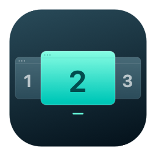

<p align="center">
  
</p>

# 窗见 · WindowPick

**macOS 同应用窗口预览与快捷切换工具 — A native macOS window preview & switcher.**

长按一瞥，松开切换。在 Chrome、Safari、Finder 等应用打开多个窗口时，长按 Command 查看当前应用的窗口缩略图，按数字或方向键选择，松开即可切换到目标窗口。

[下载 DMG 安装包](https://github.com/erjin-zhi/windowpick/releases/latest) · [详细使用说明](WindowPeek/README.md) · [反馈问题](https://github.com/erjin-zhi/windowpick/issues) · [English](#english)

**macOS 14+ · Apple Silicon · 原生 Swift / SwiftUI · 免费开源 · MIT License**

## 适合什么场景？

- **Chrome / Safari 多窗口**：工作、资料、后台各开一个窗口，通过缩略图快速找到要用的那个。
- **Finder 多目录**：在多个文件夹窗口之间切换，减少反复点开窗口菜单。
- **Terminal 多终端窗口**：不同项目、命令任务各开一个终端窗口，通过预览快速找到目标，在多个终端窗口之间切换。
- **键盘操作**：保持手指在键盘上，长按、选中、松开，完成一次窗口切换。

窗见聚焦**当前应用内部的窗口**。例如，你正在使用 Chrome 时，预览列表显示的是 Chrome 的窗口；浏览器标签页仍由浏览器管理。

## 功能要点

| 功能 | 用法与效果 |
| --- | --- |
| 窗口缩略图预览 | 横向展示当前应用的窗口快照和标题，当前前台窗口排在最前 |
| 长按预览，松开切换 | 默认长按 Command 触发，选中后松开按键即可切换 |
| 数字快速选择 | 按主键盘 1–9 直接选中对应窗口 |
| 方向键与鼠标操作 | 用 ← / → 循环选择，或点击预览卡片；窗口多时支持横向滚动 |
| 快捷循环切换 | 按 Command + 反引号（<code>&#96;</code>）立即打开预览并循环选择 |
| 自定义激活键 | 可选 Command、Option、Control、Shift，左右两侧按键均可使用 |
| 自定义长按时间 | 可选 0.15、0.25、0.4、0.6 秒，设置重启后保留 |
| 菜单栏快速开关 | 直接启用或暂停窗口切换，也可打开设置和演示 |
| Chrome 窗口对应 | 优先使用系统窗口编号匹配预览，减少同名、重叠窗口被配错的情况 |
| 多屏与全屏场景 | 预览面板显示在鼠标所在屏幕，支持全屏空间辅助浮层 |
| 按需截图 | 打开预览时获取快照，关闭后释放；截图不写入文件、不上传 |
| 应用内更新（0.3.0 起） | 使用 Sparkle 自动检查更新，也可手动检查，由用户确认下载、安装和重启 |

> 当前公开发行版为 **[0.3.1](https://github.com/erjin-zhi/windowpick/releases/tag/windowpeek-v0.3.1)**，新增组合键键帽和同一应用窗口循环切换提示。0.3.0 用户可在应用内检查更新；0.2.2 及更早版本需手动安装新版。

## 下载与安装

项目名称为 **WindowPick（窗见）**，当前发行安装包中的应用仍显示为 **Window Peek**。

1. 前往 [Releases 下载页](https://github.com/erjin-zhi/windowpick/releases/latest)，下载 `WindowPeek-<版本>-arm64-Installer.dmg`。同时提供 SHA-256 校验文件。
2. 打开 DMG，将 **Window Peek** 拖入 **Applications**。已安装的用户先退出应用，再替换原位置的副本。
3. 启动应用，从菜单栏打开设置，按照提示授予所需权限。
4. 在同一个应用中打开两个或更多窗口，长按 Command 开始使用。

需要 **macOS 14 或更新版本**。当前发行安装包面向 **Apple Silicon（M 系列芯片）**；暂不提供预编译 Intel 安装包。发行 DMG 使用 Developer ID 签名并经过 Apple 公证。

## 常用操作

| 操作 | 效果 |
| --- | --- |
| 长按 Command | 打开当前应用的窗口预览 |
| 按住激活键，按 1–9 | 选中对应窗口 |
| 按住激活键，按 ← / → | 选择上一个 / 下一个窗口 |
| 松开激活键或按 Return | 切换到选中窗口 |
| Esc 或点击面板外部 | 取消本次切换 |
| 点击缩略图 | 直接切换到该窗口 |

修改激活键后，以上长按和组合操作随之使用新按键。Command+C、Command+Tab 等其他组合操作会取消预览，继续交由原应用或系统处理。

## 权限与隐私

- **辅助功能**：用于监听快捷键、枚举应用窗口和切换目标窗口。
- **屏幕与系统音频录制**：用于获取窗口缩略图。虽然系统权限名称包含音频，窗见不采集音频；窗口画面仅在内存中使用，不保存或上传。
- **没有录屏权限时**：仍可通过标题切换窗口，缩略图区域显示占位。
- **更新检查**：0.3.0 起通过网络获取版本清单和安装包；可关闭自动检查，不影响手动检查。

部分受保护内容、最小化窗口或其他桌面空间中的窗口可能无法提供截图。没有可靠预览时保留标题与占位，不保证所有应用、所有窗口状态都能截图。更多兼容性说明见 [使用文档](WindowPeek/README.md#预览与兼容性)。

## 从源码构建

需要 macOS、Xcode Command Line Tools 和 Swift 5.10 或更新版本。首次构建会下载 Sparkle 依赖。

```bash
git clone https://github.com/erjin-zhi/windowpick.git
cd windowpick/WindowPeek
swift test
./scripts/build-app.sh --install
open "$HOME/Applications/Window Peek.app"
```

构建脚本生成本机架构的应用，优先使用本机 Developer ID 证书，无可用证书时使用临时签名。安装包、公证与更新签名的配置见 [更新与发版说明](WindowPeek/Updates/README.md)。

## English

**WindowPick (窗见)** is a free, open-source **macOS window switcher** with thumbnail previews for the **active application's windows**. Hold Command, select a window with number keys or arrow keys, then release to switch.

- Preview multiple Chrome, Safari or Finder windows with thumbnails and titles.
- Switch using keys 1–9, arrow keys or a mouse click.
- Choose Command, Option, Control or Shift as the activation key and adjust the hold delay.
- Enable or pause the switcher from the menu bar.
- Capture window snapshots on demand; screenshots stay in memory and are not saved or uploaded.
- Sparkle in-app updates are available from version 0.3.0, with automatic checks and user-confirmed installation.

Requires **macOS 14+**. Prebuilt DMG releases are for **Apple Silicon**. Accessibility permission is required for window switching; Screen Recording permission enables thumbnails. Protected or unavailable windows may show placeholders. WindowPick switches windows within the current app, rather than individual browser tabs.

[Download releases](https://github.com/erjin-zhi/windowpick/releases/latest) · [Report a bug](https://github.com/erjin-zhi/windowpick/issues) · [Source & usage guide](WindowPeek/README.md)

## 反馈与贡献

欢迎通过 [Issues](https://github.com/erjin-zhi/windowpick/issues) 报告问题或提出建议。反馈时请附上 macOS 版本、芯片类型、窗见版本、目标应用和复现步骤；截图请先遮住私人内容。

本仓库 `windowpick` 是「窗见 · WindowPick」的独立项目。应用源码、使用文档、测试和构建脚本位于 `WindowPeek/` 目录。

## 许可证

窗见采用 [MIT 许可证](LICENSE)，可免费使用、修改和分发。Sparkle 及其附带组件的声明见 [第三方许可证](WindowPeek/Updates/Sparkle-LICENSE.txt)。
